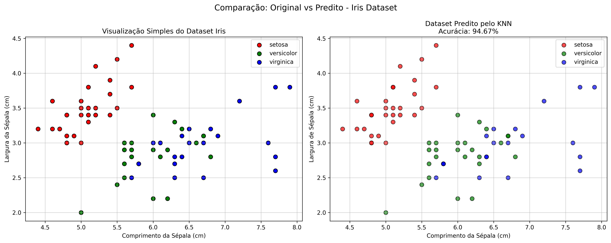
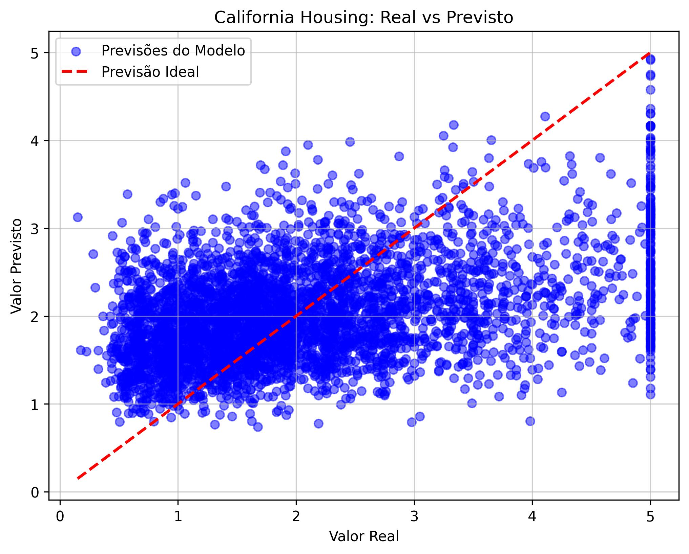
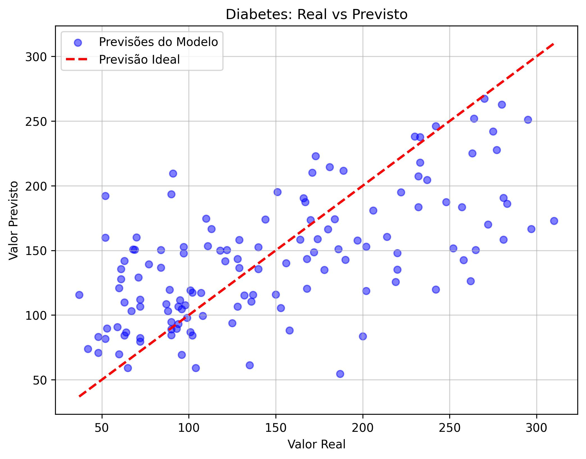

## Algoritmos Clássicos de Machine Learning

### K-Nearest Neighbors (KNN)
O algoritmo K-Nearest Neighbors (KNN) opera sob o princípio da proximidade espacial, funcionando como um método de "aprendizado preguiçoso" (lazy learning) que não constrói um modelo matemático complexo durante o treinamento, mas sim memoriza as instâncias de dados disponíveis. Para realizar uma previsão, o algoritmo projeta o novo dado no espaço vetorial e calcula a distância matemática (como a Euclidiana ou Manhattan) entre este ponto e todas as outras observações já conhecidas. Com base nessas distâncias, ele seleciona os K vizinhos mais próximos, partindo da premissa de que dados com características similares tendem a estar agrupados na mesma região geométrica.

A definição do resultado final depende se o algoritmo está sendo usado como Classificador ou Regressor. No KNN Classificador (usado para categorias discretas), a decisão é tomada por votação majoritária: o novo ponto recebe o rótulo da classe que for mais frequente entre os seus K vizinhos (a moda). Já no KNN Regressor (usado para valores contínuos), o algoritmo calcula a média simples ou ponderada dos valores numéricos dos K vizinhos e atribui esse resultado como a predição para o novo dado, suavizando as variações locais para estimar um número coerente.

 

#### **Visualização dos Modelos**
| KNN Classificador | KNN Regressor (California & Diabetes) |
| :---: | :---: |
|  |   |

**Continuação:**  
- Perceptron Neuron  
- Decision Trees  
- SOM
